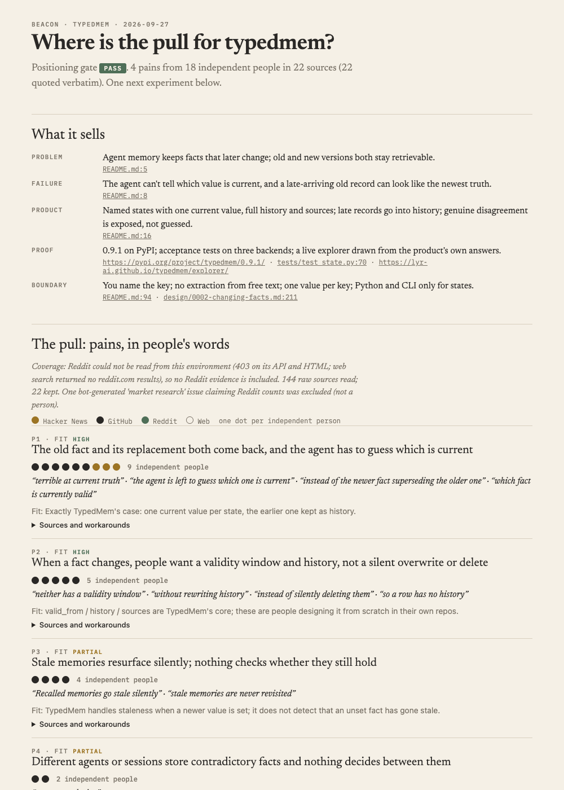

# Beacon

**Find the people who should see your project, and the one next move to reach them.**

Beacon is a go-to-market skill for the coding agent you already use. Run
`/beacon` in a project's repository and the agent investigates, rather than
brainstorms:

1. **Positioning gate.** Can the problem, the failure, the product, the
   proof and the boundary each be stated with evidence? If not, it stops:
   the project isn't ready for go-to-market, and that's a useful answer.
2. **Pain evidence.** It searches Hacker News and GitHub issues in the words
   a sufferer would use, and keeps people's **verbatim** quotes, with author,
   date and link. Strength is counted in **independent people**, not posts.
3. **Audiences.** Two to four specific groups ("maintainers designing
   supersession for their own memory layer"), never "AI developers".
4. **One experiment:** one audience × one hook × one channel × one ask,
   with a hypothesis, a success threshold, a failure condition, and what is
   *not* this round.

It writes `.beacon/launch.json` and a self-contained report.
`/beacon record` logs what happened, so the next launch starts from what
you learned.

[](docs/example-typedmem.png)

## Not a marketing-copy generator

"Post on Reddit, HN, LinkedIn and write a blog" is what you get from asking
a model how to launch. It is also the failure Beacon exists to prevent. The
test of Beacon is whether different projects get **different** strategies.
Its first three runs:

| Project | Who | The one move | Success means |
|---|---|---|---|
| [TypedMem](https://github.com/lyr-ai/typedmem) | Maintainers designing validity/supersession for their own agent memory right now | Share concrete ordering rules in the three issues where they asked for exactly this | ≥2 of 3 engage with the rules |
| [AgentSeism](https://github.com/lyr-ai/agentseism) | Teams whose eval-framework CI gates flap between runs | One answer to deepeval's re-run-semantics question, proposing a third outcome: not enough evidence | ≥1 substantive reply |
| [Heed](https://github.com/lyr-ai/heed) | Maintainers already running agent-written whole-repo reviews | **No outreach yet.** There's no outside proof, so first publish three hand-checked case studies | ≥70% of urgent/high findings correct |

All three chose against Show HN, for evidence-based reasons: the space is
crowded with similar launches, or there was no proof yet.

## Rules the validator enforces

- A quote marked **verbatim** must appear in the raw text the search
  script collected. A phrase attributed to people must appear in the
  source it cites.
- Text seen only through a summarizing tool is labelled **paraphrase** in
  the report.
- Independent authors are **counted by the validator**, never typed.
- Every positioning claim has a `file:line` in the repo or a URL.
- **No fake precision.** Any key named like a score, a percentage or "PMF"
  is rejected. The report says what was observed.
- Exactly one experiment, with a single channel. Everything else is listed
  under *not this round*, with reasons.

## Install

A skill directory plus three small Python scripts (3.10+, standard library
only; `gh` for GitHub search). No API key and no service: the agent you
already run does the reading and reasoning.

```bash
git clone https://github.com/lyr-ai/beacon ~/src/beacon
ln -s ~/src/beacon/skills/beacon ~/.claude/skills/beacon      # Claude Code
```

Then, in a project's repository: `/beacon`. After the experiment:
`/beacon record`.

Beacon never posts anything. It writes only inside `.beacon/`, and you run
the experiment.

## Limits (v0)

- Sources are Hacker News (Algolia API) and GitHub issues (`gh`). Reddit
  blocks programmatic reads from many networks, so when it can't be read,
  the report says so rather than guess.
- It measures what people wrote, not how many people have the problem
  silently.
- Three runs so far, all on its author's projects.

## Works with Heed

[Heed](https://github.com/lyr-ai/heed) looks inward (what the project is,
and what needs attention). Beacon looks outward (who has the problem, and
how to reach them). When `.heed/project.json` exists, Beacon starts from
that confirmed goal.

Also from lyr-ai: [TypedMem](https://github.com/lyr-ai/typedmem) ·
[AgentSeism](https://github.com/lyr-ai/agentseism). MIT licensed.
